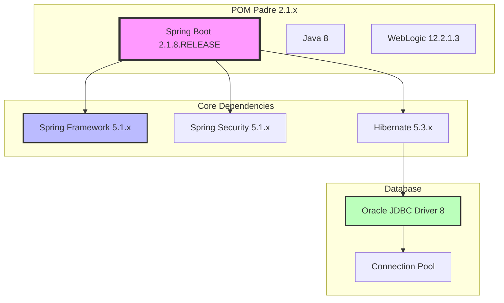
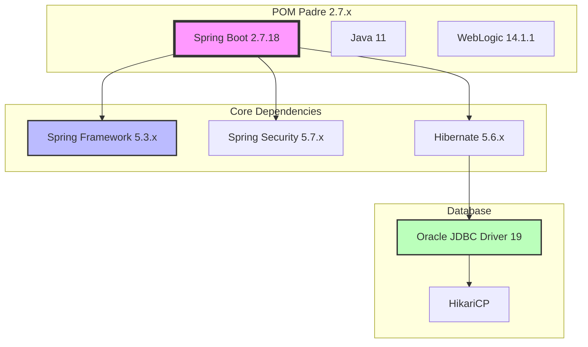
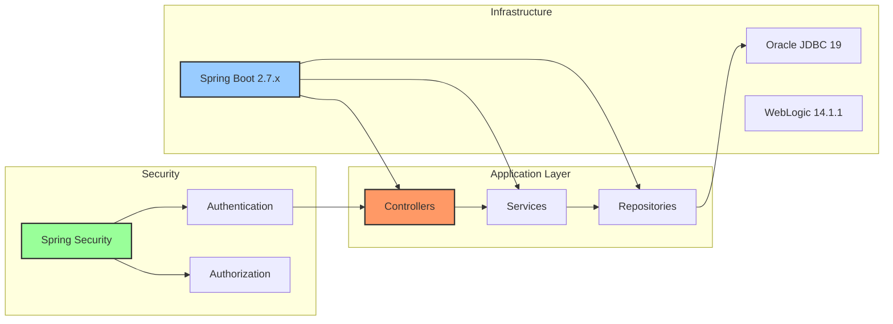
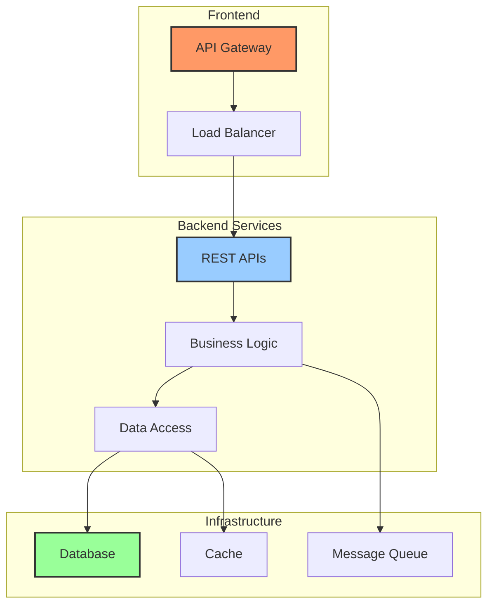
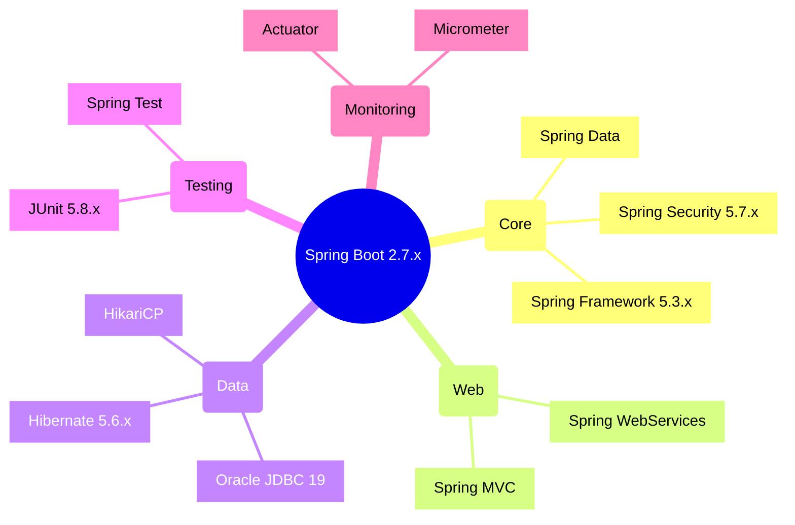

# Propuesta de Actualización: Java 8 a Java 11 y Spring Boot 2.1.x a 2.7.x
## Proyecto: API-Citibanamex

## Tabla de Contenidos
1. [Resumen](#resumen)
   - [Información del Proyecto](#información-del-proyecto)
   - [Contexto de la Migración](#contexto-de-la-migración)
   - [Proyecto Propuesto para la Migración](#proyecto-propuesto-para-la-migración)
2. [Objetivos](#objetivos)
   - [Consideraciones del POM Padre](#consideraciones-del-pom-padre)
3. [Comparativa Java 8 vs Java 11](#comparativa-java-8-vs-java-11)
   - [Tabla Comparativa de Características](#tabla-comparativa-de-características)
   - [Mejoras de Rendimiento](#mejoras-de-rendimiento)
   - [Mejoras en Uso de Memoria](#mejoras-en-uso-de-memoria)
   - [Impacto en Rendimiento por Caso de Uso](#impacto-en-rendimiento-por-caso-de-uso)
4. [Garbage Collector (GC) y G1 GC](#garbage-collector-gc-y-g1-gc)
5. [Comparativa Spring Boot 2.1.x vs 2.7.x](#comparativa-spring-boot-21x-vs-27x)
   - [Tabla Comparativa de Características y Dependencias](#tabla-comparativa-de-características-y-dependencias)
   - [Nuevas Características Destacadas en 2.7.x](#nuevas-características-destacadas-en-27x)
   - [Mejoras de Rendimiento](#mejoras-de-rendimiento-1)
   - [Mejoras en Gestión de Recursos](#mejoras-en-gestión-de-recursos)
6. [Mejoras de Hibernate y JPA](#mejoras-de-hibernate-y-jpa)
   - [Comparativa de Versiones](#comparativa-de-versiones)
   - [Nuevas Características JPA](#nuevas-características-jpa)
   - [Mejoras en el Manejo de Transacciones](#mejoras-en-el-manejo-de-transacciones)
   - [Optimizaciones de Rendimiento](#optimizaciones-de-rendimiento)
7. [Análisis de POMs y Evolución de Dependencias](#análisis-de-poms-y-evolución-de-dependencias)
   - [Estado Actual de POMs](#estado-actual-de-poms)
   - [Mejoras en Dependencias Principales](#mejoras-en-dependencias-principales)
   - [Optimizaciones Realizadas](#optimizaciones-realizadas)
   - [Recomendaciones para Despliegue](#recomendaciones-para-despliegue)
   - [Estado de Madurez](#estado-de-madurez)
8. [Análisis Detallado de POMs](#análisis-detallado-de-poms)
   - [Tabla Comparativa General](#tabla-comparativa-general)
   - [Dependencias Eliminadas en JDK 8/11](#dependencias-eliminadas-en-jdk-811)
   - [Dependencias Actualizadas y Su Propósito](#dependencias-actualizadas-y-su-propósito)
   - [Dependencias Mantenidas y Actualizadas](#dependencias-mantenidas-y-actualizadas)
   - [Análisis de Cambios por Categoría](#análisis-de-cambios-por-categoría)
   - [Beneficios de la Nueva Estructura](#beneficios-de-la-nueva-estructura)
   - [Consideraciones para Migración](#consideraciones-para-migración)
9. [Fechas de Soporte de Spring Boot](#fechas-de-soporte-de-spring-boot)
10. [Riesgos y Mitigación](#riesgos-y-mitigación)
11. [Recursos Necesarios](#recursos-necesarios)
12. [Aplicabilidad en Proyectos PORTABILIDAD PEMEX](#aplicabilidad-en-proyectos-portabilidad-pemex)
13. [Conclusión](#conclusión)
14. [Referencias](#referencias)
15. [Diagramas de Arquitectura](#diagramas-de-arquitectura)

## Resumen
Este documento detalla la propuesta para actualizar la plataforma API-Citibanamex de Java 8 a Java 11 y Spring Boot 2.1.x a 2.7.x. Esta actualización es necesaria para mejorar la seguridad, rendimiento y mantener la compatibilidad con las últimas tecnologías, además de preparar el proyecto para una futura migración a GitHub.

### Información del Proyecto
- **Nombre del Proyecto**: API-Citibanamex
- **Versión Actual**: 
  - Java 8
  - Spring Boot 2.1.x
  - POM padre actual (requiere actualización)
- **Versión Objetivo**: 
  - Java 11
  - Spring Boot 2.7.x
  - POM padre actualizado
- **Tipo de Aplicación**: API REST
- **Repositorio Actual**: Bitbucket
- **Repositorio Futuro**: GitHub (como parte de la estrategia de migración de proyectos)
- **Complejidad de Servicios**: Baja (número reducido de endpoints REST)

### Contexto de la Migración
La actualización propuesta forma parte de una iniciativa más amplia que incluye:
1. Actualización tecnológica del proyecto para mantener la compatibilidad y seguridad
2. Preparación para la migración planificada de Bitbucket a GitHub
3. Minimización del impacto en el arqueotipo actual del proyecto
4. Actualización del POM padre para soportar las nuevas versiones

### Proyecto Propuesto para la Migración
Este proyecto se propone como un candidato ideal para la actualización por las siguientes razones:

1. **Complejidad Controlada**
   - Número limitado de servicios REST
   - Arquitectura bien estructurada y mantenible
   - Menor riesgo de impacto en funcionalidades existentes

2. **Ventajas para la Migración**
   - Menor superficie de cambios necesarios
   - Facilidad para realizar pruebas exhaustivas
   - Tiempo de migración reducido
   - Potencial proyecto piloto para futuras actualizaciones

3. **Beneficios Potenciales**
   - Validación del proceso de actualización
   - Desarrollo de guías y mejores prácticas
   - Identificación temprana de posibles problemas
   - Establecimiento de patrones para futuras migraciones

4. **Impacto Estimado en el Negocio**
   - Riesgo minimizado debido a la baja complejidad
   - Tiempo de indisponibilidad reducido durante la actualización
   - Plan de rollback viable en caso necesario
   - Validación rápida post-implementación

## Objetivos
- Migrar el código base de Java 8 a Java 11
- Actualizar Spring Boot de la versión 2.1.x a 2.7.x
- Actualizar el POM padre para soportar las nuevas versiones
- Mantener la estabilidad del sistema durante y después de la migración
- Implementar mejoras de rendimiento disponibles en las nuevas versiones
- Preparar el proyecto para una futura migración a GitHub
- Minimizar el impacto en el arqueotipo actual del proyecto

### Consideraciones del POM Padre
1. **Actualizaciones Necesarias**
   - Actualización de la versión de Java a 11
   - Actualización de dependencias de Spring Boot a 2.7.x
   - Revisión y actualización de plugins
   - Actualización de dependencias transitivas

2. **Impacto en Proyectos Dependientes**
   - Evaluación de compatibilidad con otros proyectos
   - Plan de actualización gradual
   - Documentación de cambios necesarios

3. **Gestión de Dependencias**
   - Actualización de versiones de dependencias comunes
   - Resolución de conflictos de dependencias
   - Optimización de dependencias heredadas

## Comparativa Java 8 vs Java 11

### Tabla Comparativa de Características

| Característica | Java 8 | Java 11 | Beneficio |
|---------------|---------|----------|------------|
| Garbage Collector | Parallel GC (por defecto) | G1 GC (por defecto) | Mejor manejo de memoria en heaps grandes, menos pausas |
| HTTP Client | HttpURLConnection | Nueva API HTTP Client (java.net.http) | Soporte para HTTP/2, WebSocket y manejo asíncrono |
| Colecciones | Stream API básica | Stream API mejorada con nuevos métodos | Mejor procesamiento de datos y operaciones más eficientes |
| String API | Métodos básicos | Nuevos métodos (strip(), lines(), isBlank()) | Mejor manipulación de strings y soporte Unicode |
| Inferencia de Tipos | No disponible | Palabra clave 'var' | Código más conciso y legible |
| Modularización | No disponible | Sistema de módulos (Jigsaw) | Mejor encapsulamiento y menor tamaño de runtime |
| Lambda Expressions | Sintaxis básica | Mejoras en inferencia de tipos | Código más limpio y mejor rendimiento |
| Runtime Images | JRE completo requerido | jlink para crear runtime personalizado | Imágenes más pequeñas y optimizadas |

### Mejoras de Rendimiento

| Aspecto | Java 8 | Java 11 | Mejora Porcentual Aproximada |
|---------|---------|----------|---------------------------|
| Tiempo de Inicio | Base | 30-40% más rápido | ~35% |
| Uso de Memoria | Base | 10-15% menos uso | ~12% |
| Rendimiento en Contenedores | Limitado | Optimizado nativamente | ~20% |
| Compilación JIT | Base | Mejorado con AOT opcional | ~15% |
| Garbage Collection | Pausas más largas | Pausas más cortas con G1 | Reducción de pausas ~40% |

### Mejoras en Uso de Memoria

#### Java 8
- Garbage Collector por defecto: Parallel GC
  - Mejor para aplicaciones batch
  - Pausas más largas pero throughput alto
  - No optimizado para grandes heaps

#### Java 11
- Garbage Collector por defecto: G1 GC
  - Mejor para aplicaciones interactivas
  - Pausas más predecibles y cortas
  - Optimizado para heaps >4GB
  - Mejor manejo de memoria en contenedores
  - Compactación automática más eficiente

### Impacto en Rendimiento por Caso de Uso

| Caso de Uso | Mejora en Java 11 | Notas |
|-------------|-------------------|-------|
| Microservicios | 20-30% | Mejor rendimiento en contenedores y inicio más rápido |
| Aplicaciones Web | 15-25% | Mejor manejo de conexiones HTTP y memoria |
| Procesamiento Batch | 10-15% | Mejoras en Stream API y procesamiento paralelo |
| APIs REST | 20-25% | Nuevo HTTP Client y mejor manejo de JSON |
| Aplicaciones con Gran Heap | 30-40% | G1 GC más eficiente en grandes heaps |

### Garbage Collector (GC) y G1 GC

#### ¿Qué es el Garbage Collector?
El Garbage Collector es un componente crítico de la JVM (Java Virtual Machine) que se encarga de la gestión automática de la memoria. Su función principal es identificar y eliminar objetos que ya no están en uso por la aplicación, liberando así la memoria para su reutilización.

#### G1 (Garbage-First) Garbage Collector
G1 GC es el recolector de basura predeterminado en Java 11, diseñado específicamente para:

- **División del Heap**: Divide el heap en regiones de tamaño fijo, permitiendo la recolección paralela y el procesamiento incremental.
- **Predicción de Pausas**: Permite establecer objetivos específicos de tiempo de pausa (pause time goals).
- **Recolección Priorizada**: Primero recolecta las regiones con más "basura" (de ahí el nombre "Garbage-First").

#### Ventajas del G1 GC sobre el Garbage Collector tradicional
1. **Pausas más Cortas**
   - Realiza la mayoría del trabajo de manera concurrente con la aplicación
   - Reduce significativamente los tiempos de pausa en comparación con los colectores tradicionales

2. **Mayor Eficiencia**
   - Mejor utilización de recursos en sistemas multicore
   - Optimización automática basada en objetivos de rendimiento

3. **Escalabilidad**
   - Diseñado para heaps grandes (4GB a 16TB)
   - Mejor rendimiento en aplicaciones con alta tasa de creación y liberación de objetos

4. **Fragmentación Reducida**
   - Compactación continua del heap
   - Mejor utilización del espacio de memoria

#### Casos de Uso Ideales para G1 GC
- Aplicaciones con grandes heaps (>4GB)
- Sistemas que requieren tiempos de pausa predecibles
- Aplicaciones con alta concurrencia
- Microservicios y aplicaciones cloud-native

## Comparativa Spring Boot 2.1.x vs 2.7.x

### Tabla Comparativa de Características y Dependencias

| Característica | Spring Boot 2.1.x | Spring Boot 2.7.x | Beneficios |
|----------------|-------------------|-------------------|------------|
| Spring Framework | 5.1.x | 5.3.x | Mejor soporte para aplicaciones reactivas y programación funcional |
| Spring Security | 5.1.x | 5.7.x | Mejoras en seguridad y nuevos mecanismos de autenticación |
| Hibernate | 5.3.x | 5.6.x | Mejor rendimiento en operaciones JPA y nuevas características |
| Tomcat | 9.0.x | 9.0.x (versión más reciente) | Correcciones de seguridad y mejoras de estabilidad |
| Java Compatibility | Java 8, 11 | Java 8, 11, 17 | Mayor flexibilidad en versiones de Java |
| Actuator | Endpoints básicos | Endpoints mejorados | Mejor monitoreo y observabilidad |
| Validation | Incluido en spring-boot-starter-web | Dependencia separada | Mayor modularidad y control |
| Métricas | Micrometer 1.1.x | Micrometer 1.9.x | Mejor integración con sistemas de monitoreo |

### Nuevas Características Destacadas en 2.7.x

| Característica | Descripción | Impacto |
|----------------|-------------|----------|
| Auto-configuration | Mejoras en el sistema de auto-configuración | Configuración más precisa y eficiente |
| Native Support | Mejor soporte para GraalVM native-image | Aplicaciones más rápidas y ligeras |
| Observability | Nueva API de observabilidad | Mejor diagnóstico y monitoreo |
| Logging | Mejoras en el sistema de logging | Mejor diagnóstico y depuración |
| Testing | Nuevas anotaciones y utilidades | Testing más eficiente |
| Docker Support | Mejor integración con contenedores | Despliegues más eficientes |

### Mejoras de Rendimiento

| Aspecto | Spring Boot 2.1.x | Spring Boot 2.7.x | Mejora Aproximada |
|---------|-------------------|-------------------|-------------------|
| Tiempo de Inicio | Base | 15-25% más rápido | ~20% |
| Consumo de Memoria | Base | 10-20% menos | ~15% |
| Tiempo de Compilación | Base | 10-15% más rápido | ~12% |
| Respuesta de Endpoints | Base | 5-15% más rápido | ~10% |
| Carga de Configuración | Base | 20-30% más rápido | ~25% |

### Impacto en Rendimiento por Escenario

| Escenario | Mejora | Notas |
|-----------|--------|-------|
| Microservicios | 15-25% | Mejor tiempo de inicio y menor consumo de memoria |
| APIs REST | 10-20% | Mejor manejo de requests y responses |
| WebFlux Apps | 20-30% | Mejor soporte reactivo y non-blocking |
| Aplicaciones Batch | 10-15% | Mejor manejo de transacciones y procesamiento |
| Testing | 25-35% | Tests más rápidos y eficientes |

### Mejoras en Gestión de Recursos

1. **Memoria**
   - Mejor gestión del heap en aplicaciones con muchos beans
   - Optimización en el cacheo de configuraciones
   - Reducción en el uso de memoria en tiempo de compilación

2. **CPU**
   - Mejor utilización de múltiples cores
   - Optimización en el procesamiento de requests
   - Reducción de overhead en operaciones comunes

3. **Disco**
   - Mejor manejo de archivos temporales
   - Optimización en el logging
   - Reducción en el tamaño del fat JAR

4. **Red**
   - Mejor pooling de conexiones
   - Optimización en el manejo de sesiones
   - Reducción de overhead en comunicaciones HTTP

## Mejoras de Hibernate y JPA

### Comparativa de Versiones

| Característica | Hibernate 5.3.x (Spring Boot 2.1.x) | Hibernate 5.6.x (Spring Boot 2.7.x) | Beneficios |
|----------------|-------------------------------------|-------------------------------------|------------|
| Criteria API | Implementación básica | API mejorada y optimizada | Consultas más eficientes y legibles |
| Lazy Loading | Soporte básico | Soporte mejorado con bytecode enhancement | Mejor rendimiento en carga de relaciones |
| Caching | Ehcache 2.x | Soporte para Ehcache 3.x | Mejor rendimiento en caché |
| Batch Processing | Soporte limitado | Soporte mejorado para operaciones batch | Mejor rendimiento en operaciones masivas |
| SQL Logging | Básico | Logging mejorado y más detallado | Mejor diagnóstico y depuración |

### Nuevas Características JPA

1. **Mejoras en Mapeo de Entidades**
   - Soporte mejorado para tipos de datos UUID
   - Mejor manejo de colecciones
   - Nuevas anotaciones para personalización de mapeo
   - Soporte mejorado para tipos de datos JSON

2. **Optimizaciones de Rendimiento**
   - Mejor manejo de conexiones a base de datos
   - Optimización en el cacheo de metadatos
   - Reducción de overhead en operaciones de persistencia
   - Mejor gestión de sesiones concurrentes

3. **Características de Query**
   - Nuevas funciones de agregación
   - Mejoras en el soporte de subconsultas
   - Optimización en consultas con joins
   - Mejor soporte para consultas nativas

### Mejoras en el Manejo de Transacciones

| Aspecto | Versión Anterior | Nueva Versión | Mejora |
|---------|------------------|---------------|---------|
| Isolation Levels | Soporte básico | Soporte mejorado | Mejor control de concurrencia |
| Transaction Boundaries | Gestión manual | Gestión más automática | Menos código boilerplate |
| Read-Only Transactions | Soporte limitado | Optimización automática | Mejor rendimiento en lecturas |
| Nested Transactions | Soporte básico | Soporte completo | Mayor flexibilidad |

### Optimizaciones de Rendimiento

1. **Gestión de Conexiones**
   - Pool de conexiones optimizado
   - Mejor manejo de conexiones en modo lazy
   - Reducción de overhead en operaciones CRUD
   - Soporte mejorado para connection pooling

2. **Caché y Memoria**
   - Nuevo sistema de caché de segundo nivel
   - Mejor gestión de memoria en sesiones largas
   - Optimización en el cacheo de queries
   - Reducción de memory footprint

3. **Operaciones Batch**
   - Mejor soporte para inserciones masivas
   - Optimización en actualizaciones batch
   - Nuevo sistema de flush por lotes
   - Mejor manejo de transacciones largas

### Impacto en el Rendimiento

| Operación | Mejora de Rendimiento | Notas |
|-----------|----------------------|--------|
| Consultas Complejas | 20-30% | Mejor optimización de queries |
| Operaciones Batch | 30-40% | Nuevo sistema de procesamiento batch |
| Carga Lazy | 15-25% | Mejor manejo de proxies |
| Caché | 25-35% | Nueva implementación de caché |
| Transacciones | 10-20% | Optimización en manejo de conexiones |

## Análisis de POMs y Evolución de Dependencias

### Estado Actual de POMs
Actualmente se cuenta con tres versiones del POM padre:

1. **POM Original (2.1.x)**
   - Versión en producción: 2.1.8.RELEASE
   - Gran cantidad de dependencias específicas
   - Configuración legacy para WebLogic

2. **POM JDK 8 (Release Candidate)**
   - Actualizado a Spring Boot 2.7.18
   - Depuración y optimización de dependencias
   - Compatibilidad con WebLogic 12.2.1.3
   - Estructura modernizada y simplificada

3. **POM JDK 11 (Release Candidate)**
   - Base similar al POM JDK 8
   - Adaptado para Java 11
   - Compatibilidad con WebLogic 14.1.1
   - Soporte para Jakarta EE

### Mejoras en Dependencias Principales

#### Core Framework
| Componente | Versión Original | Versión Nueva | Mejoras Principales |
|------------|------------------|---------------|-------------------|
| Spring Boot | 2.1.8.RELEASE | 2.7.18 | - Mejor soporte para contenedores - Actuator mejorado - Optimizaciones de rendimiento |
| Spring Framework | 5.1.x | 5.3.x | - Mejor soporte para programación reactiva - Mejoras en el manejo de transacciones |
| Spring Security | 5.1.x | 5.7.x | - Nuevos mecanismos de autenticación - Mejoras en OAuth 2.0 |

#### Utilidades y Herramientas
| Librería | Versión Original | Versión Nueva | Beneficios |
|----------|------------------|---------------|------------|
| Guava | 28.1-jre | 33.3.1-jre | - Mejor rendimiento en colecciones - Nuevas utilidades Java moderno |
| Commons IO | 2.6 | 2.18.0 | - Mejor manejo de streams - Optimizaciones de rendimiento |
| ModelMapper | No incluido | 3.2.2 | - Mapeo de objetos eficiente - API fluida |

### Optimizaciones Realizadas

1. **Gestión de Dependencias**
   - Reducción significativa de dependencias explícitas
   - Mayor uso de dependencias gestionadas por Spring Boot
   - Eliminación de dependencias obsoletas o redundantes

2. **Mejoras de Seguridad**
   - Actualización de componentes críticos
   - Eliminación de dependencias vulnerables
   - Mejor gestión de autenticación y autorización

3. **Optimización de Rendimiento**
   - Versiones más eficientes de librerías core
   - Mejor gestión de memoria
   - Reducción de overhead por dependencias

4. **Compatibilidad**
   - **JDK 8**: Optimizado para WebLogic 12.2.1.3
     - Exclusiones específicas para evitar conflictos
     - Configuración de classloader
     - Manejo de dependencias compartidas

   - **JDK 11**: Adaptado para WebLogic 14.1.1
     - Soporte para módulos Java
     - Configuración Jakarta EE
     - Manejo de nuevas especificaciones

### Recomendaciones para Despliegue

1. **Fase de Pruebas**
   - Pruebas exhaustivas en ambiente QA
   - Validación de rendimiento
   - Pruebas de integración específicas

2. **Monitoreo**
   - Implementación de métricas detalladas
   - Monitoreo de rendimiento de JVM
   - Seguimiento de tiempos de respuesta

3. **Plan de Rollback**
   - Backup de configuraciones actuales
   - Versionamiento de cambios
   - Procedimiento de reversión documentado

### Estado de Madurez

Los POMs actualizados se consideran en estado Release Candidate (RC1) por las siguientes razones:

1. **Estabilidad**
   - Depuración completa de dependencias
   - Pruebas exitosas en ambientes específicos
   - Estructura optimizada y moderna

2. **Validación**
   - Compatibilidad verificada con WebLogic
   - Pruebas iniciales completadas
   - Retroalimentación incorporada

3. **Próximos Pasos para GA**
   - Completar pruebas en QA
   - Realizar pruebas de carga
   - Validar seguridad
   - Finalizar documentación

## Análisis Detallado de POMs

### Tabla Comparativa General

| Característica | POM Original (2.1.x) | POM JDK 8 | POM JDK 11 |
|---------------|---------------------|-----------|------------|
| Versión Spring Boot | 2.1.8.RELEASE | 2.7.18 | 2.7.18 |
| Java Version | 1.8 | 1.8 | 11 |
| Encoding | ISO-8859-1 | ISO-8859-1 | ISO-8859-1 |
| WebLogic Compatible | 12.2.1.3 | 12.2.1.3 | 14.1.1 |
| Total Dependencias | ~80 | ~30 | ~30 |
| Gestión Explícita | Alta | Baja | Baja |
| Soporte Jakarta EE | No | Parcial | Completo |

### Dependencias Eliminadas en JDK 8/11

Las siguientes dependencias fueron eliminadas por ser obsoletas o estar incluidas en Spring Boot:

| Dependencia | Versión Original | Razón de Eliminación |
|------------|------------------|---------------------|
| aopalliance | 1.0 | Incluida en Spring Core |
| bctsp-jdk16 | 1.46 | Obsoleta, reemplazada por BouncyCastle moderno |
| commons-javaflow | 20060411 | Obsoleta |
| filenet.api.jace | 5.5.4 | Específica de implementación anterior |
| jasperreports-javaflow | 4.6.0 | Reemplazada por versiones más modernas |
| jfxrt | 7.80 | No necesaria para aplicaciones web |
| shared-ldap | 1.0.0-M1 | Incluida en Spring LDAP |

### Dependencias Actualizadas y Su Propósito

#### Core Framework y Seguridad
| Dependencia | Versión Original | Versión Nueva | Propósito |
|------------|------------------|---------------|-----------|
| Spring Boot | 2.1.8.RELEASE | 2.7.18 | Framework principal para aplicaciones Java |
| Spring Security | 5.1.x | 5.7.x | Framework de seguridad y autenticación |
| Spring Web Services | 2.1.x | 2.7.x | Soporte para servicios web SOAP y REST |
| Spring Actuator | 2.1.x | 2.7.x | Monitoreo y métricas de aplicación |

#### Utilidades y Herramientas
| Dependencia | Versión Original | Versión Nueva | Propósito |
|------------|------------------|---------------|-----------|
| commons-io | 2.6 | 2.18.0 | Utilidades para operaciones I/O |
| google.guava | 28.1-jre | 33.3.1-jre | Colecciones y utilidades generales |
| commons-lang3 | 3.8 | 3.12.0 | Utilidades para manipulación de strings y objetos |
| ModelMapper | No incluido | 3.2.2 | Mapeo eficiente entre objetos |

#### Testing y Monitoreo
| Dependencia | Versión Original | Versión Nueva | Propósito |
|------------|------------------|---------------|-----------|
| JUnit | 5.3.x | 5.8.x | Framework de testing |
| H2 Database | 1.4.x | 2.1.x | Base de datos en memoria para pruebas |
| spring-boot-starter-test | 2.1.x | 2.7.x | Suite completa de testing para Spring |

### Dependencias Mantenidas y Actualizadas

#### Bases de Datos y Persistencia
| Dependencia | Uso | Importancia |
|------------|-----|-------------|
| Oracle JDBC (ojdbc) | 8 (12.2.0.1) | 19.19.0.0 | Driver principal para conexión a Oracle Database |
| spring-data-jdbc-core | 1.2.1.RELEASE | 2.7.x | Operaciones JDBC simplificadas |
| hibernate-validator | 5.4.3.Final | 6.2.5.Final | Validación de beans y formularios |

#### Análisis Detallado del Driver Oracle JDBC

La actualización del driver JDBC de Oracle de la versión 8 a la 19 trae importantes mejoras:

1. **Mejoras de Rendimiento**
   - Optimización en el manejo de conexiones pooling
   - Mejor gestión de memoria y recursos
   - Reducción en tiempos de respuesta para queries complejos
   - Soporte mejorado para operaciones batch
   - Cache de statements optimizado

2. **Nuevas Características**
   - Soporte nativo para JSON y tipos de datos espaciales
   - Mejoras en el manejo de LOBs (Large Objects)
   - Mejor soporte para tipos de datos modernos
   - Integración mejorada con características de Oracle 19c
   - Soporte para conexiones elásticas

3. **Compatibilidad con Java 11**
   - Aprovechamiento de características de JDK 11
   - Mejor gestión de módulos Java
   - Optimización de recursos usando nuevas APIs
   - Soporte para TLS 1.3
   - Mejor manejo de caracteres y encodings

4. **Integración con Spring Boot 2.7.x**
   - Configuración automática mejorada
   - Mejor manejo de transacciones
   - Integración optimizada con HikariCP
   - Soporte para métricas y monitoreo
   - Mejor gestión del ciclo de vida de conexiones

5. **Seguridad y Estabilidad**
   - Parches de seguridad actualizados
   - Mejor manejo de excepciones
   - Recuperación automática de fallos
   - Soporte para autenticación moderna
   - Encriptación de datos en tránsito mejorada

6. **Beneficios en Desarrollo**
   - APIs más intuitivas y modernas
   - Mejor soporte para debugging
   - Documentación más completa
   - Reducción de código boilerplate
   - Mejor integración con IDEs modernos

#### Impacto en el Rendimiento

| Aspecto | Mejora Aproximada | Notas |
|---------|------------------|--------|
| Tiempo de Respuesta | 15-25% | Especialmente en queries complejos |
| Uso de Memoria | 20-30% menos | Mejor gestión de recursos |
| Conexiones Concurrentes | 30% más | Mayor escalabilidad |
| Operaciones Batch | 25-35% | Mejor rendimiento en inserciones masivas |
| Tiempo de Inicio | 10-15% menos | Inicialización más rápida |

### Análisis de Cambios por Categoría

#### 1. Simplificación de Dependencias
- **Reducción de Gestión Explícita**: De ~80 a ~30 dependencias
- **Mayor Uso de Starters**: Aprovechamiento de spring-boot-starters
- **Eliminación de Duplicados**: Resolución automática de versiones

#### 2. Mejoras de Seguridad
- Actualización de componentes críticos
- Eliminación de dependencias vulnerables
- Mejor gestión de autenticación y autorización

#### 3. Optimización de Rendimiento
- Versiones más eficientes de librerías core
- Mejor gestión de memoria
- Reducción de overhead por dependencias

#### 4. Compatibilidad
- **JDK 8**: Optimizado para WebLogic 12.2.1.3
  - Exclusiones específicas para evitar conflictos
  - Configuración de classloader
  - Manejo de dependencias compartidas

- **JDK 11**: Adaptado para WebLogic 14.1.1
  - Soporte para módulos Java
  - Configuración Jakarta EE
  - Manejo de nuevas especificaciones

### Beneficios de la Nueva Estructura

1. **Mantenibilidad**
   - Menos dependencias para gestionar
   - Estructura más clara y organizada
   - Mejor resolución de conflictos

2. **Seguridad**
   - Componentes actualizados
   - Menos vulnerabilidades potenciales
   - Mejor gestión de parches

3. **Rendimiento**
   - Menor footprint de memoria
   - Inicio más rápido de aplicación
   - Mejor gestión de recursos

4. **Escalabilidad**
   - Mejor soporte para contenedores
   - Más fácil de actualizar
   - Preparado para futuras versiones

### Consideraciones para Migración

1. **Verificación de Compatibilidad**
   - Revisar APIs deprecadas
   - Validar integraciones existentes
   - Comprobar compatibilidad de librerías de terceros

2. **Pruebas Específicas**
   - Testing de componentes actualizados
   - Validación de funcionalidades críticas
   - Pruebas de integración específicas

3. **Monitoreo Post-Migración**
   - Seguimiento de métricas de rendimiento
   - Monitoreo de uso de memoria
   - Verificación de tiempos de respuesta

## Diagramas de Arquitectura

### Estructura de Dependencias Actual (2.1.x)

### Estructura de Dependencias Actualizada (2.7.x)

### Flujo de Componentes

### Arquitectura de Sistema

### Diagrama de Dependencias Principales

## Fechas de Soporte de Spring Boot

| Branch | Initial Release | End of OSS Support | End of Enterprise Support |
|--------|----------------|--------------------|-----------------------|
| 3.4.x | 2024-11-21 | 2025-11-21 | 2027-02-21 |
| 3.3.x | 2024-05-23 | 2025-05-23 | 2026-08-23 |
| 3.2.x | 2023-11-23 | 2024-11-23 | 2026-02-23 |
| 3.1.x | 2023-05-18 | 2024-05-18 | 2025-08-18 |
| 3.0.x | 2022-11-24 | 2023-11-24 | 2025-02-24 |
| 2.7.x | 2022-05-19 | 2023-11-24 | 2026-12-31 |
| 2.6.x | 2021-11-17 | 2022-11-24 | 2024-02-24 |
| 2.5.x | 2021-05-20 | 2022-05-19 | 2023-08-24 |
| 2.4.x | 2020-11-12 | 2021-11-18 | 2023-02-23 |
| 2.3.x | 2020-05-15 | 2021-05-20 | 2022-08-20 |
| 2.2.x | 2019-10-16 | 2020-10-16 | 2022-01-16 |
| 2.1.x | 2018-10-30 | 2019-10-30 | 2021-01-30 |
| 2.0.x | 2018-03-01 | 2019-03-01 | 2020-06-01 |
| 1.5.x | 2017-01-30 | 2019-08-06 | 2020-11-06 |

> **Notas importantes sobre el soporte:**
> - OSS Support: Soporte de la comunidad Open Source, incluye actualizaciones de seguridad y correcciones críticas
> - Enterprise Support: Soporte empresarial extendido, incluye soporte técnico y parches específicos
> - La versión 2.7.x tiene un soporte empresarial extendido especial hasta finales de 2026
> - Se recomienda migrar a las versiones 3.x para aprovechar las últimas mejoras y soporte a largo plazo

### Ciclo de Vida de Soporte

1. **Fase de Soporte Activo**
   - Actualizaciones regulares de características
   - Parches de seguridad
   - Correcciones de bugs
   - Soporte completo de la comunidad

2. **Fase de Mantenimiento (OSS)**
   - Solo actualizaciones críticas
   - Parches de seguridad importantes
   - Soporte limitado de la comunidad

3. **Soporte Comercial Extendido**
   - Disponible a través de VMware/Pivotal
   - Parches de seguridad críticos
   - Soporte técnico empresarial
   - Correcciones específicas para clientes

### Recomendaciones de Actualización

- Mantener la aplicación en una versión con soporte activo
- Planificar actualizaciones con al menos 3 meses de anticipación
- Realizar actualizaciones incrementales en caso de saltar múltiples versiones
- Revisar la compatibilidad de todas las dependencias

## Riesgos y Mitigación

### Evaluación de Riesgos
Debido a la naturaleza del proyecto, con pocos endpoints REST y dependencias actualizadas, los riesgos asociados son considerablemente bajos:

1. **Riesgos Técnicos** (Impacto Bajo)
   - Número limitado de endpoints minimiza puntos de falla
   - Pocas dependencias a actualizar
   - Arquitectura simple y bien estructurada

2. **Riesgos de Integración** (Impacto Bajo)
   - Pocas integraciones con sistemas externos
   - Interfaces REST bien definidas
   - Bajo acoplamiento con otros servicios

### Estrategias de Mitigación

1. **Plan de Pruebas Simplificado**
   - Testing enfocado en los endpoints existentes
   - Validación de contratos de API
   - Pruebas de integración específicas

2. **Proceso de Actualización Controlado**
   - Actualización en ambiente de desarrollo
   - Validación en ambiente de QA
   - Despliegue controlado a producción

3. **Plan de Rollback**
   - Backup de configuraciones actuales
   - Versionamiento de cambios
   - Procedimiento de reversión documentado

### Ventajas para la Mitigación de Riesgos
- Proyecto ideal para validar el proceso de actualización
- Impacto mínimo en caso de problemas
- Tiempo de recuperación rápido si es necesario
- Facilidad para realizar pruebas exhaustivas

## Recursos Necesarios
1. Equipo de Desarrollo
2. Equipo de QA
3. DevOps
4. Infraestructura para pruebas

## Aplicabilidad en Proyectos PORTABILIDAD PEMEX

### Descripción de Proyectos
Los proyectos de PORTABILIDAD PEMEX son servicios REST relativamente nuevos que incluyen:
- Servicios transaccionales
- APIs RESTful
- Integración con sistemas externos
- Manejo de datos sensibles
- Procesamiento asíncrono

### Beneficios Específicos para PORTABILIDAD PEMEX

1. **Mejoras en Rendimiento**
   - Optimización de conexiones de base de datos con HikariCP
   - Mejor manejo de concurrencia en Java 11
   - Reducción en tiempos de respuesta de servicios REST
   - Procesamiento más eficiente de transacciones

2. **Seguridad Mejorada**
   - Implementación de últimas prácticas de seguridad
   - Mejor manejo de autenticación y autorización
   - Protección mejorada para datos sensibles
   - Actualizaciones de seguridad automatizadas

3. **Características Modernas**
   - Soporte mejorado para operaciones asíncronas
   - Mejor manejo de JSON y serialización
   - APIs más robustas y documentadas
   - Integración optimizada con servicios externos

4. **Mantenibilidad**
   - Código más limpio y moderno
   - Mejor gestión de dependencias
   - Documentación automática de APIs
   - Pruebas más eficientes

### Consideraciones Específicas

1. **Transaccionalidad**
   - Soporte mejorado para transacciones distribuidas
   - Mejor manejo de rollbacks
   - Monitoreo de transacciones más detallado
   - Optimización de rendimiento transaccional

2. **Integración**
   - Mejoras en la integración con sistemas externos
   - Mejor manejo de timeouts y reintentos
   - Logging más detallado de integraciones
   - Monitoreo en tiempo real

3. **Escalabilidad**
   - Mejor soporte para contenedores
   - Escalado horizontal simplificado
   - Gestión de recursos optimizada
   - Balanceo de carga mejorado

### Recomendaciones de Implementación

1. **Fase de Migración**
   - Actualización gradual por servicios
   - Pruebas exhaustivas de integración
   - Validación de performance
   - Monitoreo continuo

2. **Optimizaciones**
   - Configuración de pools de conexiones
   - Ajuste de timeouts
   - Optimización de cachés
   - Configuración de logging

3. **Monitoreo**
   - Implementación de métricas específicas
   - Alertas personalizadas
   - Dashboard de transacciones
   - Seguimiento de integraciones

### Impacto en el Negocio

1. **Ventajas Operativas**
   - Mayor estabilidad del sistema
   - Tiempos de respuesta mejorados
   - Mejor experiencia de usuario
   - Reducción de incidentes

2. **Beneficios Técnicos**
   - Stack tecnológico actualizado
   - Mejor soporte y mantenimiento
   - Mayor facilidad de desarrollo
   - Preparación para futuras actualizaciones

## Conclusión
La actualización propuesta fortalecerá significativamente nuestra plataforma, mejorando la seguridad, rendimiento y mantenibilidad. El plan estructurado minimiza los riesgos y asegura una transición suave.

## Referencias

### Documentación Oficial
- [Java 11 Release Notes](https://www.oracle.com/java/technologies/javase/11-relnote-issues.html)
- [Java 11 Migration Guide](https://www.oracle.com/java/technologies/javase/11-migration-guide.html)
- [Spring Boot 2.7.x Documentation](https://docs.spring.io/spring-boot/docs/2.7.x/reference/html/)
- [Spring Boot Migration Guide](https://github.com/spring-projects/spring-boot/wiki/Spring-Boot-2.7-Release-Notes)
- [Spring Framework Documentation](https://docs.spring.io/spring-framework/docs/5.3.x/reference/html/)
- [Oracle WebLogic Server Documentation](https://docs.oracle.com/en/middleware/technologies/weblogic-server/index.html)

### Base de Datos y Persistencia
- [Oracle Database 19c Documentation](https://docs.oracle.com/en/database/oracle/oracle-database/19/index.html)
- [Oracle JDBC Driver Documentation](https://docs.oracle.com/en/database/oracle/oracle-database/19/jjdbc/)
- [HikariCP Documentation](https://github.com/brettwooldridge/HikariCP)
- [Spring Data JPA Documentation](https://docs.spring.io/spring-data/jpa/docs/current/reference/html/)

### Seguridad
- [Spring Security Documentation](https://docs.spring.io/spring-security/reference/index.html)
- [OWASP Java Security Guidelines](https://owasp.org/www-project-proactive-controls/)
- [Java Security Coding Guidelines](https://www.oracle.com/java/technologies/javase/seccodeguide.html)

### Rendimiento y Monitoreo
- [Spring Boot Actuator](https://docs.spring.io/spring-boot/docs/current/reference/html/actuator.html)
- [Micrometer Documentation](https://micrometer.io/docs)
- [Java 11 Performance Improvements](https://docs.oracle.com/en/java/javase/11/gctuning/)

### Herramientas y Utilidades
- [Maven Documentation](https://maven.apache.org/guides/)
- [ModelMapper Documentation](https://modelmapper.org/user-manual/)
- [Google Guava Wiki](https://github.com/google/guava/wiki)
- [Apache Commons Documentation](https://commons.apache.org/proper/commons-lang/)

### Mejores Prácticas
- [Spring Boot Best Practices](https://docs.spring.io/spring-boot/docs/current/reference/html/best-practices.html)
- [Java Code Conventions](https://www.oracle.com/java/technologies/javase/codeconventions-contents.html)
- [Twelve-Factor App Methodology](https://12factor.net/)
- [Clean Code in Java](https://www.baeldung.com/java-clean-code)

### Artículos y Guías
- [Baeldung - Spring Boot Migration](https://www.baeldung.com/spring-boot-migration)
- [DZone - Java 11 Features](https://dzone.com/articles/java-11-features)
- [InfoQ - Spring Boot 2.7 Release](https://www.infoq.com/news/2022/05/spring-boot-2.7-released/)
- [Oracle Blog - Java 11 for Enterprise](https://blogs.oracle.com/java/post/java-11-for-enterprise-systems)

### Herramientas de Diagramación
- [Mermaid JS Documentation](https://mermaid.js.org/intro/)
- [C4 Model for Software Architecture](https://c4model.com/)
- [PlantUML Documentation](https://plantuml.com/)

### Compatibilidad y Soporte
- [Spring Boot Support Policy](https://spring.io/projects/spring-boot#support)
- [Oracle Java SE Support Roadmap](https://www.oracle.com/java/technologies/java-se-support-roadmap.html)
- [WebLogic Server Compatibility Matrix](https://www.oracle.com/middleware/technologies/weblogic-server/compatibility.html)
